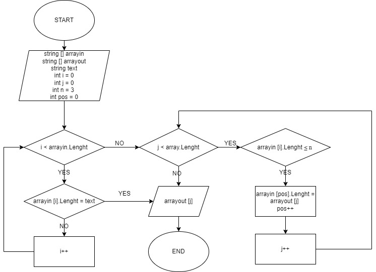

# Задача
Написать программу, которая из имеющегося массива строк формирует новый массив из строк,длина которых меньше, либо равна 3 символам. Первоначальный массив можно ввести с клавиатуры, либо задать на старте выполнения алгоритма. При решении не рекомендуется пользоваться коллекциями, лучше обойтись исключительно массивами.

*Алгоритм*

1. Ввод данных.
2. Проверка элемента массива на условие - длина элемента массива меньше или равно 3?
3. Если элемент удовлетворяет условие, то он добавляется в новый массив.
4. Исходя из количества элементов массива, программа будет проверять каждый элемент.
5. Вывод массива с элементами, которые удволетворяют условию п.2.

*Блок-Схема*

